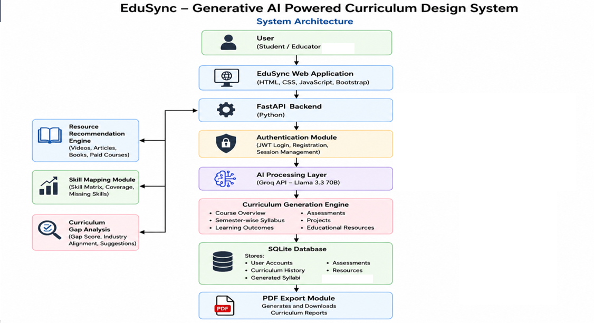
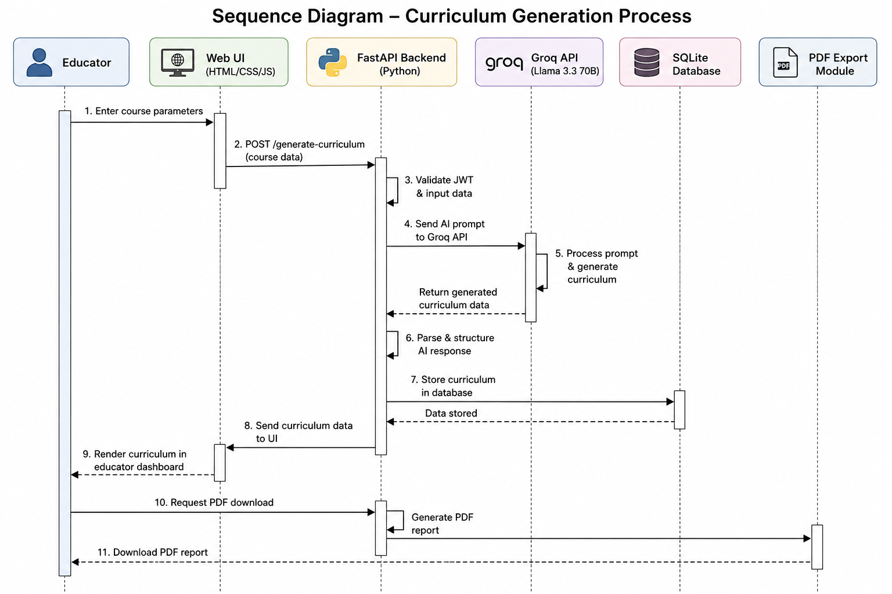
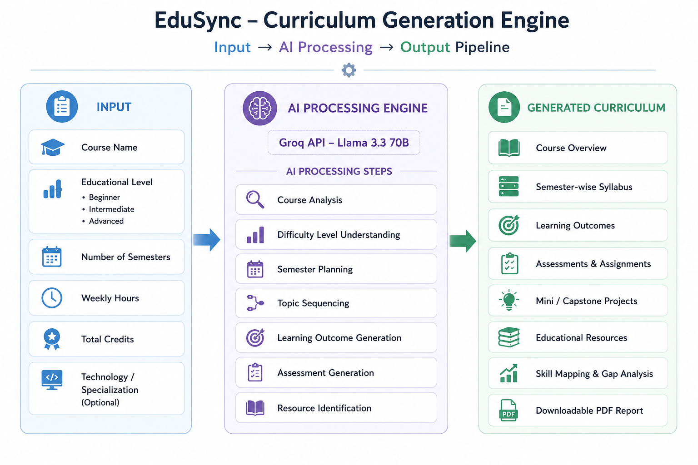

# 🎓 EduSync – Generative AI Powered Curriculum Design System

<div align="center">

### Transforming Curriculum Design with Artificial Intelligence

EduSync is an intelligent AI-powered educational platform that automates curriculum creation, generates personalized learning plans, and provides AI-driven educational resources using Groq API and Llama 3.3 70B.

</div>

---

# 📖 Overview

Traditional curriculum development requires educators to manually create course structures, learning outcomes, assessments, projects, and educational resources. This process is time-consuming and difficult to continuously align with rapidly changing industry standards.

EduSync addresses this challenge by integrating Generative AI with a modern full-stack architecture. By leveraging Groq API and the Llama 3.3 70B Large Language Model (LLM), the platform automatically generates structured, industry-relevant, and outcome-based curricula.

The platform serves two major users:

## 👨‍🏫 Educators

Educators can:

- Generate complete AI-powered curricula
- Create semester-wise syllabus structures
- Generate Bloom’s Taxonomy-based learning outcomes
- Generate assignments, quizzes, and examinations
- Create mini-projects and capstone projects
- Perform curriculum analysis and skill-gap identification
- Export professional curriculum reports as PDFs

---

## 👨‍🎓 Students

Students can:

- Generate personalized weekly learning plans
- Receive AI-based educational resource recommendations
- Practice AI-generated assessments
- Track their learning progress through analytics

---

# ✨ Key Features

## 🤖 AI Curriculum Generation

- Course overview generation
- Semester-wise syllabus design
- Learning outcome generation
- Assignment and quiz creation
- Examination generation
- Mini and capstone project recommendations
- Educational resource suggestions
- Skill mapping and analysis

---

## 🔍 Curriculum Analysis

EduSync evaluates existing curricula and identifies:

- Missing concepts
- Outdated technologies
- Industry skill gaps
- Suggested improvements

---

## 📄 PDF Export

Users can download professional curriculum reports containing:

- Course information
- Semester-wise syllabus
- Learning outcomes
- Assessments
- Projects
- Recommended resources

---

# 🏛 System Architecture

EduSync follows a multi-layer client-server architecture consisting of frontend, backend, AI processing, database management, authentication, and PDF generation components.

## Architecture Diagram



### Architecture Components

### User Layer
- Educators
- Students

### Frontend Layer
Developed using:

- HTML5
- CSS3
- JavaScript
- Bootstrap

Provides responsive user interfaces and communicates with backend APIs.

### Backend Layer

Built using Python FastAPI.

Responsibilities:

- REST API handling
- Business logic implementation
- AI communication
- Database operations
- Authentication management

### AI Processing Layer

Powered by:

- Groq API
- Llama 3.3 70B Model

Generates:

- Curriculum structures
- Learning outcomes
- Assessments
- Projects
- Resources
- Study plans

### Database Layer

SQLite stores:

- User accounts
- Generated curricula
- Learning plans
- Assessments
- Educational resources
- Curriculum history

### Security Layer

Uses JWT Authentication for:

- User registration
- Secure login
- Role-based access control
- Protected API access

### Report Generation

Creates downloadable PDF curriculum documents.

---

# 🔄 Curriculum Generation Workflow

The following workflow demonstrates how educator inputs are processed through the AI system to generate complete curricula.

## Workflow Diagram



## Workflow Steps

1. Educator enters course information.
2. Frontend sends requests to FastAPI APIs.
3. Backend validates user authentication using JWT.
4. The system prepares optimized prompts.
5. Requests are sent to Groq API.
6. Llama 3.3 70B generates educational content.
7. AI responses are processed and structured.
8. Data is stored in SQLite database.
9. Generated curriculum is displayed to the user.
10. Curriculum can be downloaded as a PDF report.

---

# 🧠 AI Curriculum Generation Pipeline

The AI pipeline transforms educator requirements into structured educational content.

## AI Pipeline Diagram



---

## Input Parameters

The educator provides:

- Course name
- Academic level
- Number of semesters
- Weekly teaching hours
- Total credits
- Technology specialization

---

## AI Processing

The LLM performs:

- Course understanding
- Difficulty analysis
- Semester planning
- Topic sequencing
- Bloom’s Taxonomy learning outcome generation
- Assessment creation
- Resource recommendation
- Skill mapping

---

## Generated Output

The final AI-generated curriculum contains:

- Course overview
- Semester-wise syllabus
- Learning outcomes
- Assignments
- Quizzes
- Examinations
- Mini projects
- Capstone projects
- Recommended resources
- Skill-gap analysis
- Professional PDF reports

---

# 🛠 Technology Stack

## Frontend

- HTML5
- CSS3
- JavaScript
- Bootstrap

## Backend

- Python
- FastAPI
- Uvicorn

## Artificial Intelligence

- Groq API
- Llama 3.3 70B

## Database

- SQLite

## Security

- JWT Authentication
- Protected API Routes

---

# 📁 Project Structure

```
EduSync/
│
├── assets/
│   ├── architecture.png
│   ├── workflow.png
│   └── pipeline.png
│
├── frontend/
│   ├── login.html
│   ├── home.html
│   ├── generate.html
│   ├── about.html
│   ├── contact.html
│   ├── css/
│   │   └── style.css
│   └── js/
│       └── app.js
│
├── backend/
│   ├── main.py
│   ├── auth.py
│   ├── generator.py
│   ├── resources.py
│   ├── database.py
│   └── prompts/
│
├── requirements.txt
├── .env
└── README.md
```

---

# ⚙️ Installation & Setup

## 1. Clone the Repository

```bash
git clone <repository-url>
cd EduSync
```

---

## 2. Create Virtual Environment

### Windows

```bash
python -m venv venv
venv\Scripts\activate
```

### Linux / macOS

```bash
python3 -m venv venv
source venv/bin/activate
```

---

## 3. Install Dependencies

```bash
pip install -r requirements.txt
```

---

# 🔑 Configure Environment Variables

Create a `.env` file in the root directory:

```env
GROQ_API_KEY=your_groq_api_key_here
SECRET_KEY=your_random_secret_string
```

Get a free Groq API key:

https://console.groq.com/keys

---

# ▶️ Running the Application

Start the FastAPI development server:

```bash
uvicorn backend.main:app --reload
```

The application will run at:

```
http://127.0.0.1:8000
```

---

# 🔐 Authentication Flow

1. User registers as Educator or Student.
2. User credentials are securely stored.
3. User logs into the application.
4. Backend generates a JWT access token.
5. Protected APIs require a valid token.

---

# 📡 API Endpoints

| Method | Endpoint | Description |
|---|---|---|
| POST | `/auth/register` | Register a new user |
| POST | `/auth/login` | Authenticate user and return JWT token |
| POST | `/generate` | Generate AI-powered curriculum |
| GET | `/resources` | Retrieve AI-recommended resources |
| GET | `/assessment` | Generate or fetch assessments |
| GET | `/learning-plan` | Generate personalized weekly study plans |

---

# 🚀 Future Scope

Future improvements include:

- Integration with multiple AI models
- Multilingual curriculum generation
- Cloud-based database migration
- Learning Management System (LMS) integration
- Real-time educator collaboration
- Mobile application support
- Advanced student analytics
- Adaptive AI-based assessments and feedback

---

# 🎯 Learning Outcomes

This project demonstrates practical knowledge of:

- Generative AI and LLM integration
- Prompt engineering
- FastAPI backend development
- REST API design
- JWT-based authentication
- SQLite database management
- Full-stack web development
- AI-driven educational platforms

---

# 📜 License

This project is developed for educational and research purposes.

---

<div align="center">

## 🌟 EduSync – Building the Future of Intelligent Education with Artificial Intelligence

Powered by Groq • Llama 3.3 70B • FastAPI • SQLite

</div>
